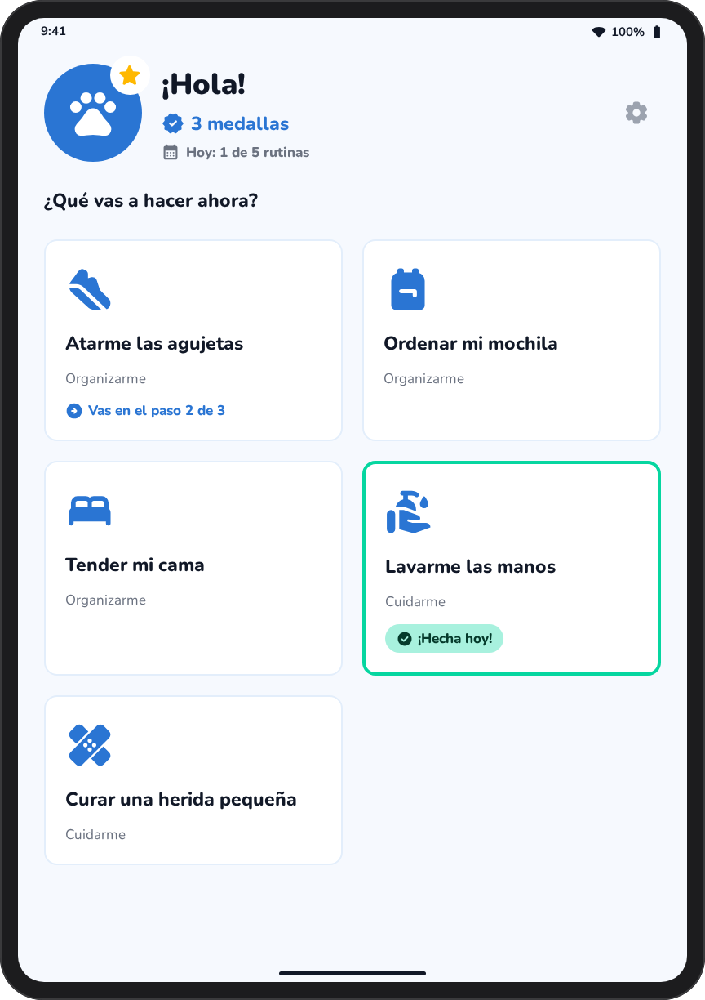
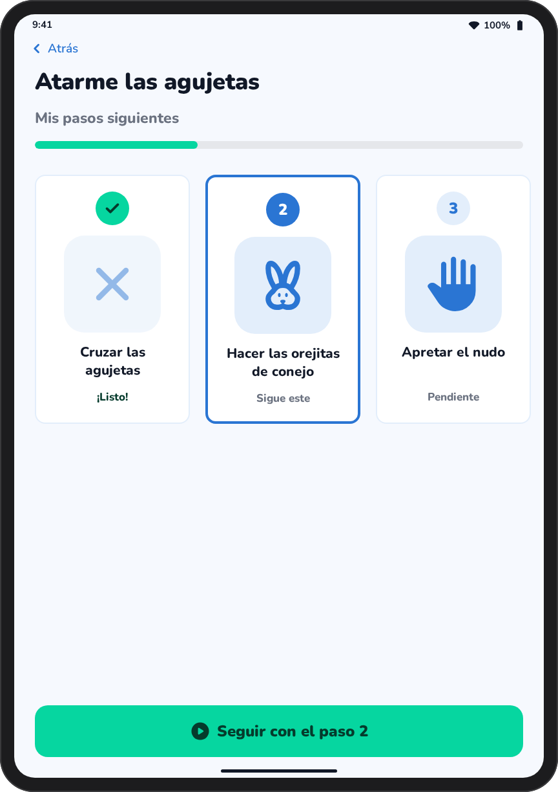
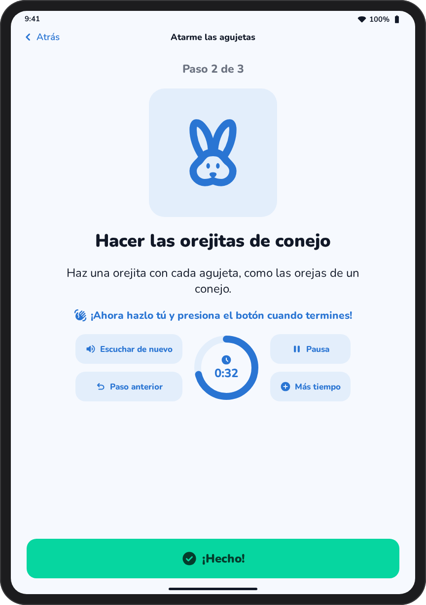
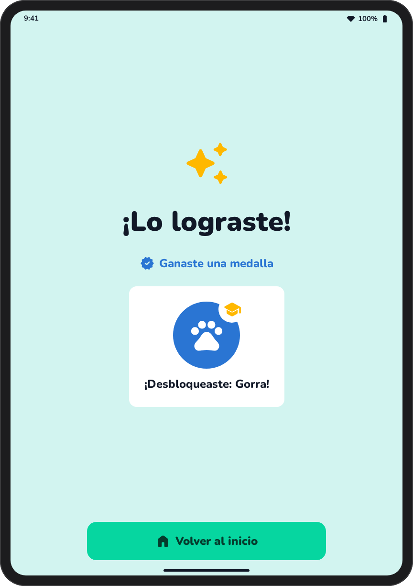
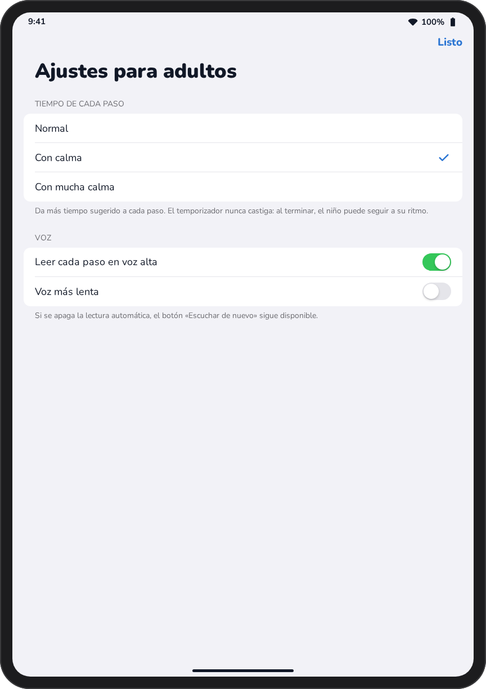
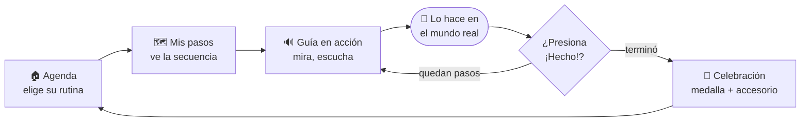

<div align="center">

# 🐾 Me Cuido, Me Organizo

**Una guía visual y hablada en iPad para que niños y niñas de 8 a 12 años con TDA y retos motrices
hagan sus rutinas diarias por sí mismos.**

[](https://www.swift.org)
[](https://developer.apple.com/xcode/swiftui/)
[](#-avance-actual)
[](#-accesibilidad)

*Proyecto de la materia **Aula Inclusiva** · Design Thinking + Apple Human Interface Guidelines*

</div>

---

> [!IMPORTANT]
> **«Toda ayuda innecesaria incapacita».** La app muestra el *cómo*, pero la acción la hace el niño
> **en el mundo real**. Cada paso termina cuando él mismo presiona **«¡Hecho!»**.

## 🎯 ¿Qué resuelve?

A muchos niños con TDA les cuesta **recordar qué paso sigue**, **mantener la atención** y **coordinar
movimientos finos**. *Me Cuido, Me Organizo* convierte cada rutina en una secuencia corta de
pictogramas grandes, narración en voz alta y un temporizador que acompaña sin presionar, y
premia el esfuerzo con accesorios para su mascota.

<table>
<tr>
<td align="center" width="20%">👟<br><b>Atarme las agujetas</b><br><sub>Organizarme</sub></td>
<td align="center" width="20%">🎒<br><b>Ordenar mi mochila</b><br><sub>Organizarme</sub></td>
<td align="center" width="20%">🛏️<br><b>Tender mi cama</b><br><sub>Organizarme</sub></td>
<td align="center" width="20%">🧼<br><b>Lavarme las manos</b><br><sub>Cuidarme</sub></td>
<td align="center" width="20%">🩹<br><b>Curar una herida pequeña</b><br><sub>Cuidarme</sub></td>
</tr>
</table>

Cada rutina tiene **3 pasos**. Por ejemplo, atarse las agujetas: *cruzar las agujetas → hacer las
orejitas de conejo → apretar el nudo*.

## 📱 Así se ve

<table>
<tr>
<td align="center" width="33%"><br><b>1 · Agenda y mascota</b></td>
<td align="center" width="33%"><br><b>2 · Mis pasos siguientes</b></td>
<td align="center" width="33%"><br><b>3 · Guía visual en acción</b></td>
</tr>
<tr>
<td align="center"><br><b>Celebración</b></td>
<td align="center"><br><b>Ajustes para adultos</b></td>
<td align="center" valign="middle"><sub>Mismos textos, colores, tamaños y estados que el código SwiftUI.</sub></td>
</tr>
</table>

> [!NOTE]
> Estas imágenes son **maquetas** generadas a partir del diseño y del código; los íconos de SF Symbols
> se sustituyeron por equivalentes. Se reemplazarán por capturas reales del simulador de iPad.

## 🧭 Cómo se usa



| Pantalla | Qué ve el niño |
| :--- | :--- |
| **1 · Agenda y mascota** | Tarjetas grandes de sus rutinas, sus medallas, su mascota y cuáles ya hizo **hoy** |
| **2 · Mis pasos siguientes** | Barra de progreso y los 3 pasos en pictogramas, con el siguiente resaltado |
| **3 · Guía visual en acción** | Pictograma animado, instrucción narrada, temporizador de anillo y el botón gigante **«¡Hecho!»** con vibración |
| **Celebración** | «¡Lo lograste!», una medalla y, a veces, un accesorio nuevo para la mascota |
| **Ajustes para adultos** | Ritmo del temporizador, lectura automática y voz más lenta |

> [!TIP]
> **Para adultos:** mantén presionado el ⚙️ engrane del inicio **2 segundos** para abrir los ajustes.
> Así el niño no los cambia por accidente.

## ✨ Avance actual

**Versión 0.2.1**

- [x] Agenda del día con mascota, medallas y rutinas «¡Hecha hoy!»
- [x] Secuencia de pasos con progreso visual
- [x] Guía con narración en español de México, temporizador y retroalimentación háptica
- [x] Medallas y 5 accesorios desbloqueables (estrella, gorra, corazón, corona, avión de papel)
- [x] El progreso se guarda: si la app se cierra, sigue donde se quedó
- [x] Ajustes para adultos: ritmo *Normal / Con calma / Con mucha calma* y opciones de voz
- [x] Campanitas de logro, soporte de texto grande y convivencia con VoiceOver
- [x] Pruebas automáticas de la lógica (`swift test`)
- [ ] Pictogramas y animaciones ilustradas propias (hoy usa SF Symbols)
- [ ] Editar rutinas y pasos desde los ajustes para adultos
- [ ] Prueba con niños del rango de edad

> **Criterio de éxito de la primera versión:** que un niño complete una rutina de 3 pasos
> guiándose solo con la app, de principio a fin.

## ♿ Accesibilidad

| | Decisión | Por qué |
| :---: | :--- | :--- |
| 👆 | Áreas táctiles de **60×60 pt** o más y botón principal de **80 pt** de alto | Compensa la imprecisión motriz |
| 🔊 | Cada instrucción se **narra en voz alta** | No depende de leer textos largos |
| 🗣️ | Etiquetas de **VoiceOver** en todos los controles | Navegable sin ver la pantalla |
| 🐢 | Soporte para **Reducir movimiento** | Evita la sobreestimulación |
| ✔️ | El estado **nunca depende solo del color** (números → palomitas) | Compatible con *Diferenciar sin color* |
| 🌗 | Texto oscuro sobre verde, con contraste **AA** | Legible para todos |
| 💙 | **Sin penalizaciones** y sin rojo: el temporizador no castiga | Menos ansiedad y frustración |
| 🔤 | **SF Rounded** con Dynamic Type | Letra amable que respeta el tamaño elegido |

## 🎨 Identidad visual

| Color | Uso |
| :--- | :--- |
|  | **Azul cálido** · color principal, calma y confianza |
|  | **Verde esperanza** · éxito y botón «¡Hecho!» |
|  | **Verde profundo** · texto sobre verde |
|  | **Amarillo pastel** · pausa |
|  | **Azul suave** · reintento (nunca rojo) |
|  | **Dorado** · recompensas |

## 🚀 Cómo abrirla

El proyecto es un paquete de app de Swift Playgrounds: [`MeCuido.swiftpm`](MeCuido.swiftpm).

| Dispositivo | Pasos |
| :--- | :--- |
| 💻 **Mac** | Abre la carpeta `MeCuido.swiftpm` con **Xcode 15+** y ejecuta en un simulador de iPad |
| 📱 **iPad** | Copia la carpeta `MeCuido.swiftpm` a **Swift Playgrounds 4.4+** y toca ▶︎ |

Requiere **iPadOS 17**.

**Pruebas de la lógica:** desde la raíz del repositorio, `swift test` (Mac o Linux).

<details>
<summary><b>🗂️ Estructura del proyecto</b></summary>

```
MeCuido.swiftpm/
├── Package.swift
├── App/MeCuidoApp.swift
├── Models/          Routine, Reward (accesorios), ProgressStore, SettingsStore, StepTimer
├── Services/        SpeechService (voz es-MX), SoundService (campanitas), AudioSession
├── Theme/           Colores, espaciado y formas del documento de diseño
└── Views/           Home, RoutineSteps, StepGuide, Celebration, AvatarPicker, Settings + Components
Package.swift        MeCuidoCore: compila Models/ para las pruebas
Tests/               Pruebas de la lógica (XCTest)
```

</details>

📄 El documento de diseño completo, con Design Thinking, principios HIG, flujo y validación, está en
[`docs/documento-de-diseno.md`](docs/documento-de-diseno.md).

## 👥 Equipo

<table>
<tr>
<td align="center">Andrea<br><b>Mateo Maximino</b></td>
<td align="center">Ana Cecilia<br><b>Medina Hernández</b></td>
<td align="center">María Fernanda<br><b>Medina Ramírez</b></td>
<td align="center">Félix Yael<br><b>Tavera Ramírez</b></td>
<td align="center">Evan Isaac<br><b>Hernández Pérez</b></td>
</tr>
</table>

<div align="center">
<sub>Hecho con 💙 para que cada niño y niña se cuide y se organice a su propio ritmo.</sub>
</div>
